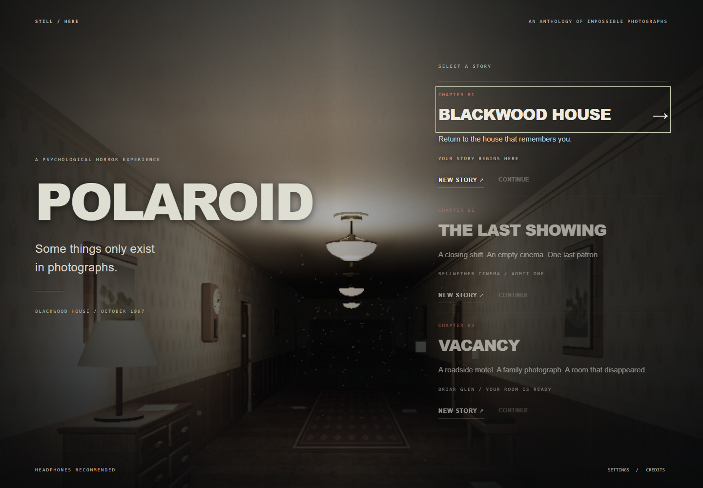

# POLAROID



A playable first-person psychological horror anthology for desktop browsers. Choose **Chapter 01 - Blackwood House** or **Chapter 02 - The Last Showing** in the same POLAROID application. Both share its tactile camera, sculpted player hand, photographic identity and settings, with separate story saves.

## Visual presentation

The Last Showing now includes optional physical records about the patron and his daughter, Ada's shift notes and a missing witness account. New documents stay in the photographic journal alongside the simpler main checklist. The cinema has aged plaster, patterned carpet, patched upholstery, mounted signs and clear lobby openings. Its human characters use distinct original face textures and articulated hands; see [chapter details](docs/THE-LAST-SHOWING.md) and [asset provenance](docs/CINEMA-ASSETS.md).

A restrained analog picture pairs muted colors, gentle highlight spill and a slightly softer scene with clear sans-serif titles and subtitles. Both chapters share the treatment; disable **Analog picture** in settings for the clean render, or select reduced effects. Grain remains at 0.015 or below. The cinema figures have civilian jackets, shirts, trousers and more defined faces; contact shading and flashlight shadows ground the furniture.

## Play

The supplied standalone build can be started with **Start-Polaroid.cmd** on Windows, or `node play.mjs` on any platform with Node.js installed. Open **http://127.0.0.1:3000**. The standalone build needs no package installation.

Requires Node.js 22.12+ (Node.js 24 recommended) and a desktop browser with WebGL and hardware acceleration.

```sh
npm install
npm run dev
```

Open **http://127.0.0.1:3000**. Hover or focus a chapter on the right to preview its full-screen photograph. Choose **New Story** or **Continue**, then enter the selected chapter to enable sound and mouse capture. When browser mouse capture is unavailable, drag to look or use the arrow keys. All game assets are local; gameplay makes no network requests.

```sh
npm run build
npm run preview
```

The production build is in `dist/`. Serve that directory over HTTP; opening `index.html` directly as a file will not load its modules.

## Controls

| Action                    | Input                               |
| ------------------------- | ----------------------------------- |
| Move                      | W A S D                             |
| Look                      | Mouse, drag, or arrow keys          |
| Sprint                    | Hold Shift                          |
| Crouch                    | Ctrl or X                           |
| Open, collect, read, hide | E                                   |
| Photograph                | C or left click with mouse captured |
| Viewfinder                | Hold right mouse                    |
| Flashlight                | F                                   |
| Inspect / tilt held print | R / mouse                           |
| Put print away            | Q                                   |
| Journal                   | J or Tab                            |
| Recall objective          | H                                   |
| Pause                     | Esc or P                            |

## The Last Showing

Bellwether Cinema is closing permanently. Complete three survey tasks, uncover Ada Bell's evacuation attempt with two photographs under one investigation reel, find the missing film, and open the service exit during the final screening. Clear objectives guide one step at a time; no drawer code or repeated audience comparisons are required. The patron advances when projection stops and stays where it is when the motor restarts. The expanded foyer separates ticketing, concessions and a furnished waiting lounge. Labelled hinged doors connect the auditorium, upstairs booth, archive, backstage and service route.

The chapter includes a recorded manager message, positional projector and mechanical sounds, real developing photographs, distinct photographic puzzles, a final departure and a completed-story marker. The pause menu returns to story selection. Blackwood's existing save key and latest gameplay remain intact; cinema progress and photographs use a separate versioned save. Settings are shared.

See [chapter guide, spoiler walkthrough and integration notes](docs/THE-LAST-SHOWING.md). The intended 20-35 minute first-play duration has not been established by human playtesting.

## Blackwood House

- A connected house of twenty areas: a central hall with six rooms off it, a west wing of conservatory, library and laundry, an east wing of parlour and gallery, two upstairs bedrooms with a guest room and bathroom behind them, working staircases, an attic, a basement workshop, ritual chamber and cold store, and an exterior porch. Room loops offer alternate escape routes.
- Real scene photographs with a four-second development period, hidden supernatural figures, an inspectable physical print, and a persistent photograph journal.
- Four evidence photographs, a randomized attic combination, a hidden cellar key, four ritual frames, a blackout, a hunted return to the entrance, the final photograph, and a walkable escape into the storm.
- An Observer with dormant, watching, investigating, searching, stalking, chasing, and retreating states. It uses spatial routes, obstruction-aware vision, sound events, last-known-position memory, and a detection warning before catching the player.
- Physical doors, light switches, hiding wardrobes, sprinting, crouching, a forgiving flashlight battery, eight starting exposures, seven film packs, and an emergency film reserve.
- A recorded camera shutter and recorded footsteps, synthesized positional sound elsewhere, storm lighting, rain, environmental disturbances with cooldowns, animated curtains and candle flames, procedural materials, and a modeled handheld camera.
- Separate colour, normal, and roughness textures for worn plaster, floorboards, glazed tile, bare concrete, metal, fabric, and skin: staggered boards with their own grain and knots, bevelled tiles with grout and crazing, troweled concrete with hairline cracks, and plaster with damp streaks. Wall, board, tile, and concrete maps are 1024², and lights occasionally fail.
- Furniture that sits where furniture sits: wardrobes, couches, dressers, bookcases, shelving, radiators and beds set flush against their walls and turned to face into the room. Rooms are dressed with armchairs, sideboards, hearths, plants, crates, trunks, tubs and framed photographs.
- Interior doors at a believable 1.05 m with lapped casings, wider 1.15 m leaves on the entrance, attic and cellar, and open 1.5 m archways between paired rooms.
- Enclosed stairwells, corrected wall joins and trim, fitted locked door openings, and chairs facing their tables.
- Quiet exploration without looping static, surface-specific footsteps cut from a single concrete walk recording and voiced per floor, quieter crouching, heavier running, mechanical door sounds, short room reflections, and positional Observer breathing and steps muffled through walls.
- Checkpoints after evidence, keys, puzzle progress, and ritual steps. Journal images and settings persist in browser local storage.
- Unlettered doors and a continuous sculpted camera-holding hand with five tapered digits, nails, knuckle detail, skin variation, and a fitted sleeve cuff.
- An articulated Observer gait driven by actual travel, with bending knees and elbows, foot lift and placement, body sway, smooth turns, idle transitions, a faster chase stride, and footsteps triggered by foot contact.

This is a compact browser interpretation of the brief. Environments and characters use procedural geometry and materials; the camera shutter and footsteps are supplied recordings and the rest of the audio is synthesized. The hand is procedurally sculpted and the Observer uses an articulated joint hierarchy. It does not include scanned photorealistic assets, motion-capture animation, or a verified 25–45-minute first-play duration. Additional clock puzzles and the full list of optional room types are not implemented.

## Verification

```sh
npm test
npm run test:smoke
npm run test:systems
npm run test:progression
npm run test:death
npm run test:polish
npm run test:characters
npm run test:analog-style
```

Browser tests require the development server and an installed Google Chrome. They create isolated browser profiles and do not use or modify your normal browser data.

The analog presentation check also works against the standalone build. It verifies visible scene pixels, shader compilation, typography and the shared effects toggle in both chapters, and saves menu, environment and character screenshots.

The character test also requires Vite. It checks the actual hand and Observer joint hierarchies, door lettering removal, foot clearance, walking/chase contacts, and settling to idle; it saves hand close-ups and walking poses to `artifacts/`.

Pass an alternate server URL after `--`, for example `npm run test:polish -- http://127.0.0.1:3102`. The polish test needs the Vite development server: it builds an isolated scene to check chair orientation, overlapping walls, stair enclosure sightlines, clear stair routes, and locked door openings. Offline Web Audio rendering verifies that both recordings decode, that the walk recording splits into separate footfalls, and that footstep surfaces stay audible and distinct, with reduced crouch volume and silence at idle and after sound effects end. Its review screenshots are in `artifacts/polish-*.png`.

The unit suite checks stairs, collision, sight lines, photographic targeting, paths around obstacles, doors, AI memory and retreat, ritual order, saves, and objectives. Browser tests check rendering, camera development, actual keyboard movement, doors, hiding, film recovery, settings, persistence, all four evidence captures, the lock, key, ritual, exterior escape, and checkpoint recovery after death. The progression suite uses fixture checkpoints between rooms to test the complete chain without a long traversal; a separate route check verifies connectivity to all areas.

Screenshots are saved to `artifacts/`. Performance samples are local test measurements, not a guarantee across hardware.

## Source

- `src/main.js`: renderer, controls, camera capture, menus, journal, progression, saves.
- `src/world.js`: architecture, geometry, procedural materials, lighting, and environmental details.
- `src/hand.js`: continuous hand surface, grip anatomy, nails, folds, and sleeve.
- `src/observer-animation.js`: travel-driven walking, leg inverse kinematics, turning, and foot contacts.
- `src/materials.js`: procedural colour, normal, and roughness maps for plaster, boards, tile, concrete, metal, fabric and skin, tiling seamlessly at three world units.
- `src/logic.js`: navigation, collision, evidence rules, state, and Observer AI.
- `src/audio.js`: Web Audio spatial effects and ambience, recorded-sample loading, and footstep slicing.
- `src/sfx/`: the supplied camera shutter and concrete walk recordings.
- `src/style.css`: title screen, HUD, printed photographs, and journal.

Three.js is distributed under the MIT license. Vite and Playwright are development dependencies. POLAROID is a fictional game project and is not affiliated with Polaroid Corporation.

Original ideas for subsequent episodes are in [the anthology concept notes](docs/ANTHOLOGY.md).
