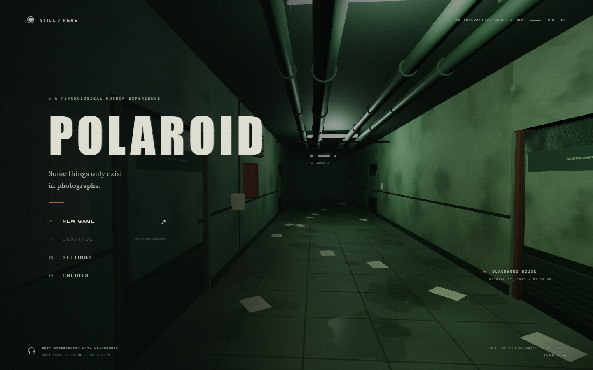

# POLAROID



A playable first-person psychological horror game built for desktop browsers. Its visual direction follows the supplied reference: damp green walls, exposed pipes, rusted doors, worn surfaces, cold fluorescent lighting, and deep shadows.

## Play

The supplied standalone build can be started with **Start-Polaroid.cmd** on Windows, or `node play.mjs` on any platform with Node.js installed. Open **http://127.0.0.1:3000**. The standalone build needs no package installation.

Requires Node.js 22.12+ (Node.js 24 recommended) and a desktop browser with WebGL and hardware acceleration.

```sh
npm install
npm run dev
```

Open **http://127.0.0.1:3000**. Click **New Game** to enable sound and mouse capture. When browser mouse capture is unavailable, drag to look or use the arrow keys. All game assets are local; gameplay makes no network requests.

```sh
npm run build
npm run preview
```

The production build is in `dist/`. Serve that directory over HTTP; opening `index.html` directly as a file will not load its modules.

## Controls

| Action                    | Input                               |
| ------------------------- | ----------------------------------- |
| Move                      | W A S D                             |
| Look                      | Mouse, drag, or arrow keys          |
| Sprint                    | Hold Shift                          |
| Crouch                    | Ctrl or X                           |
| Open, collect, read, hide | E                                   |
| Photograph                | C or left click with mouse captured |
| Viewfinder                | Hold right mouse                    |
| Flashlight                | F                                   |
| Inspect / tilt held print | R / mouse                           |
| Put print away            | Q                                   |
| Journal                   | J or Tab                            |
| Recall objective          | H                                   |
| Pause                     | Esc or P                            |

## What is playable

- A connected house with six ground-floor rooms, two upstairs bedrooms, working staircases, an attic, basement workshop and ritual chamber, and an exterior porch. Room loops offer alternate escape routes.
- Real scene photographs with a four-second development period, hidden supernatural figures, an inspectable physical print, and a persistent photograph journal.
- Four evidence photographs, a randomized attic combination, a hidden cellar key, four ritual frames, a blackout, a hunted return to the entrance, the final photograph, and a walkable escape into the storm.
- An Observer with dormant, watching, investigating, searching, stalking, chasing, and retreating states. It uses spatial routes, obstruction-aware vision, sound events, last-known-position memory, and a detection warning before catching the player.
- Physical doors, light switches, hiding wardrobes, sprinting, crouching, a forgiving flashlight battery, eight starting exposures, five film packs, and an emergency film reserve.
- Synthesized positional sound, storm lighting, rain, environmental disturbances with cooldowns, animated curtains and candle flames, procedural materials, and a modeled handheld camera.
- Separate colour, normal, and roughness textures for worn plaster, wood, tile, metal, fabric, and skin; higher resolution wall and wood surfaces, subtle damp patches, and occasional faulty fluorescent lights.
- Enclosed stairwells, corrected wall joins and trim, fitted locked door openings, and chairs facing their tables.
- Quiet exploration without looping static, surface-specific heel/toe footsteps, quieter crouching, heavier running, mechanical door sounds, short room reflections, and positional Observer breathing and steps muffled through walls.
- Checkpoints after evidence, keys, puzzle progress, and ritual steps. Journal images and settings persist in browser local storage.

This is a compact browser interpretation of the brief. Environments and characters use procedural geometry and materials; audio is synthesized. It does not include scanned photorealistic assets, skeletal character animation, or a verified 25–45-minute first-play duration. Additional clock puzzles and the full list of optional room types are not implemented.

## Verification

```sh
npm test
npm run test:smoke
npm run test:systems
npm run test:progression
npm run test:death
npm run test:polish
```

Browser tests require the development server and an installed Google Chrome. They create isolated browser profiles and do not use or modify your normal browser data.

Pass an alternate server URL after `--`, for example `npm run test:polish -- http://127.0.0.1:3102`. The polish test needs the Vite development server: it builds an isolated scene to check chair orientation, overlapping walls, stair enclosure sightlines, clear stair routes, and locked door openings. Offline Web Audio rendering verifies audible, distinct footstep surfaces, reduced crouch volume, and silence at idle and after sound effects end. Its review screenshots are in `artifacts/polish-*.png`.

The unit suite checks stairs, collision, sight lines, photographic targeting, paths around obstacles, doors, AI memory and retreat, ritual order, saves, and objectives. Browser tests check rendering, camera development, actual keyboard movement, doors, hiding, film recovery, settings, persistence, all four evidence captures, the lock, key, ritual, exterior escape, and checkpoint recovery after death. The progression suite uses fixture checkpoints between rooms to test the complete chain without a long traversal; a separate route check verifies connectivity to all areas.

Screenshots are saved to `artifacts/`. Performance samples are local test measurements, not a guarantee across hardware.

## Source

- `src/main.js`: renderer, controls, camera capture, menus, journal, progression, saves.
- `src/world.js`: architecture, geometry, procedural materials, lighting, and environmental details.
- `src/materials.js`: procedural colour, normal, and roughness maps with consistent texture repeats.
- `src/logic.js`: navigation, collision, evidence rules, state, and Observer AI.
- `src/audio.js`: Web Audio spatial effects and ambience.
- `src/style.css`: title screen, HUD, printed photographs, and journal.

Three.js is distributed under the MIT license. Vite and Playwright are development dependencies. POLAROID is a fictional game project and is not affiliated with Polaroid Corporation.
